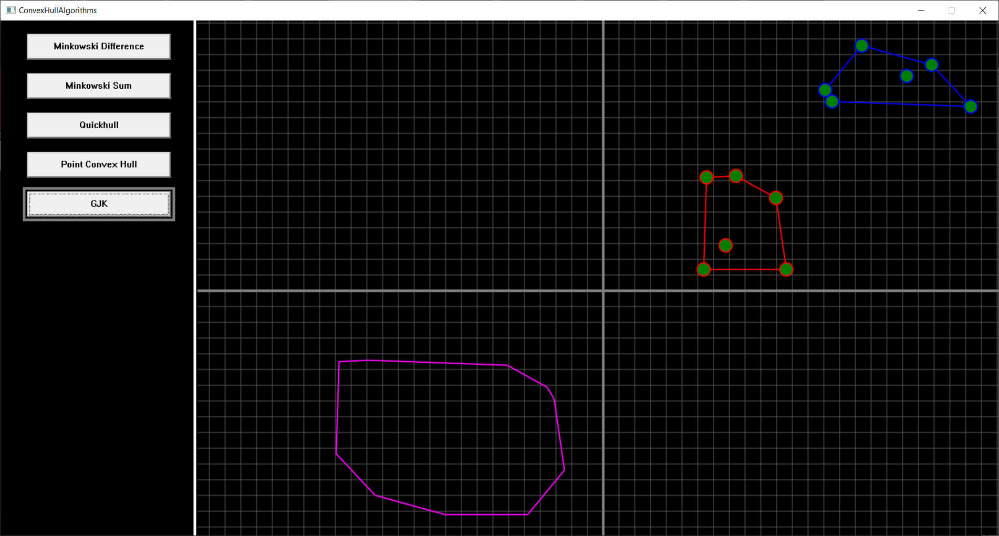

# Convex Hull Algorithms

CSE 381: 3D Game Programming  
Fall 2022  
Homework #2
  
A remake of five colllision detection algorithms from https://algorithms-for-games.firebaseapp.com/ in C++.
- Minkowski Difference
- Minkowski Sum
- Quickhull
- Point Convex Hull Intersection
- GJK

This assignment was originally completed with a partner, this version consists of only code written by me.

